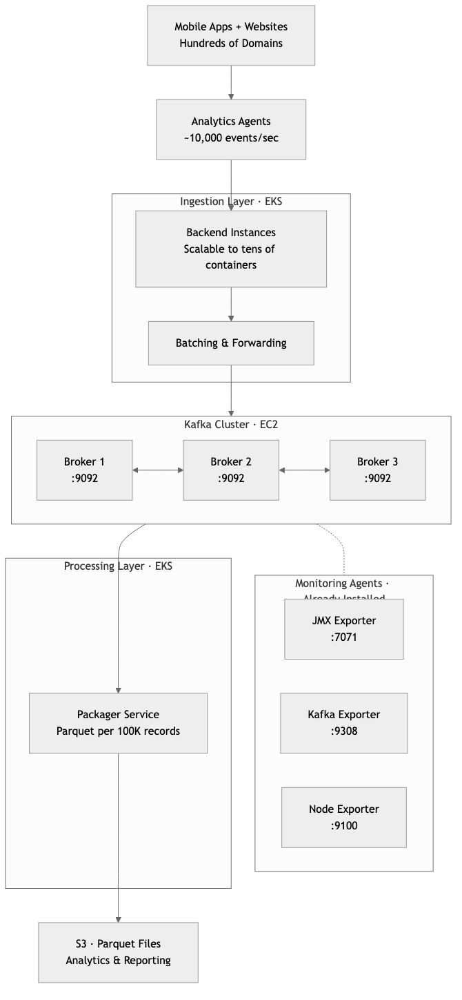
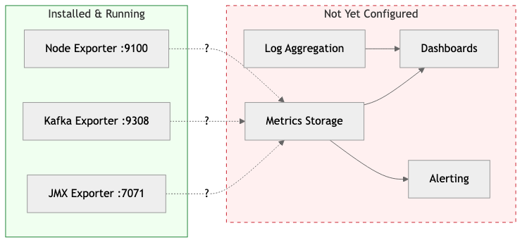
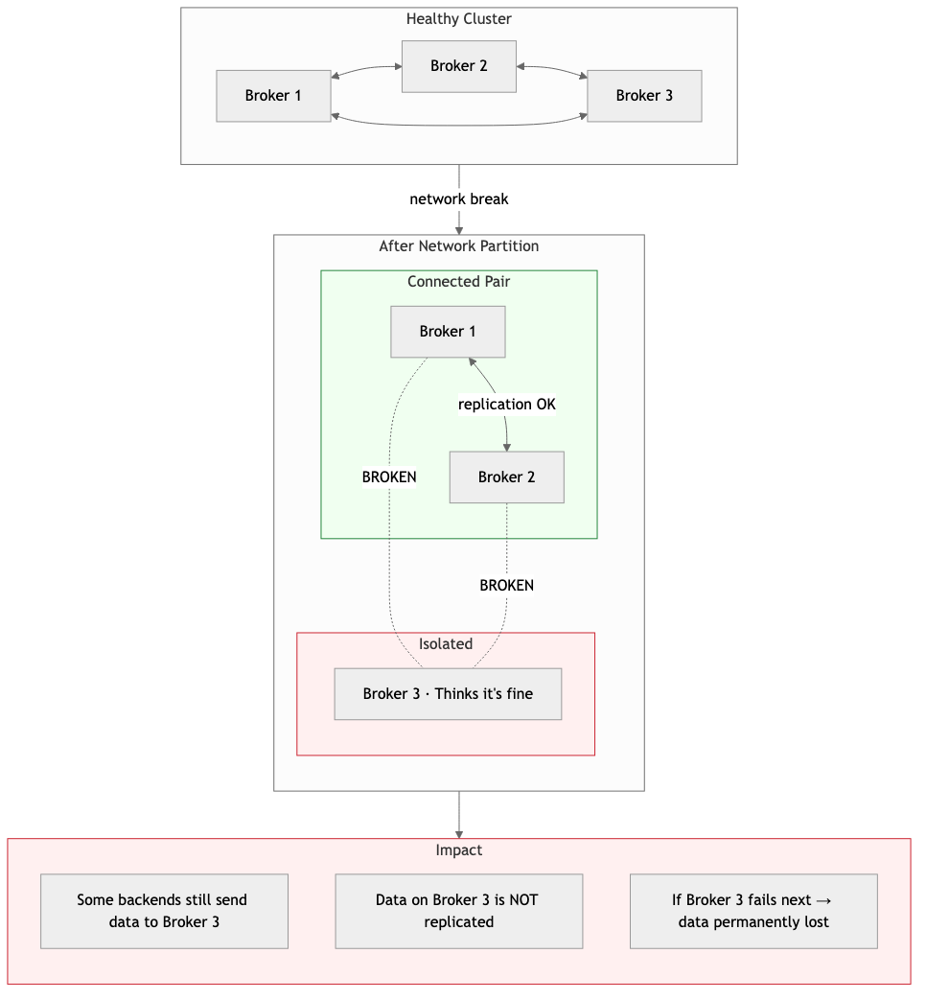
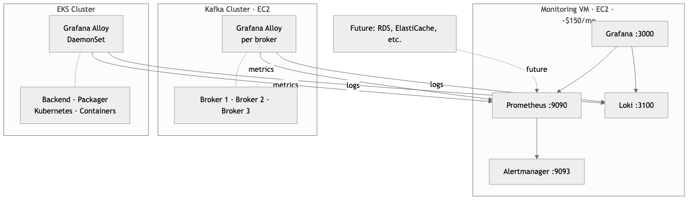
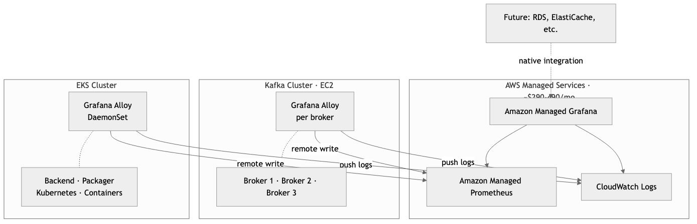
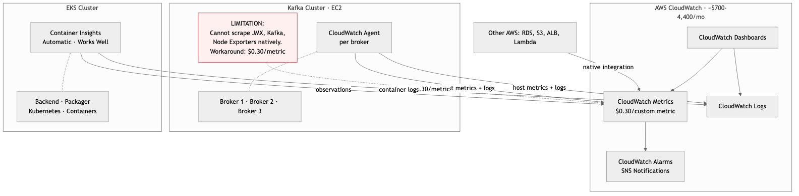
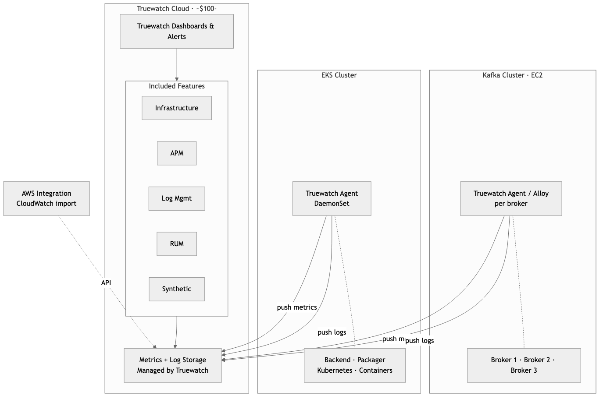
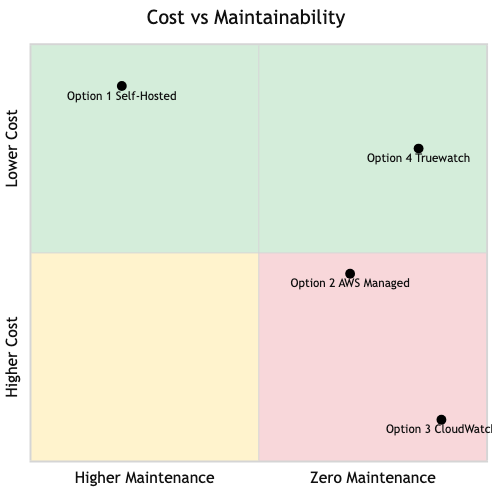

# Kafka Infrastructure Monitoring Specification

## Executive Summary

Your analytics platform processes data from hundreds of web and mobile domains, handling up to **10,000 events per second**. These events flow through a multi-stage pipeline — from collection agents, through backend services, into Apache Kafka, and finally into S3 as Parquet files for analytics.

**Kafka is the heart of this pipeline.** Every analytics event passes through it. If Kafka slows down, events queue up in your backend containers. If Kafka stops, data collection stops. If a consumer falls behind, your Parquet files arrive late — or not at all. The worst scenario: **these failures can happen silently**, with no one aware until analytics reports show gaps or missing data.

Infrastructure monitoring solves this by providing three capabilities:

1. **Visibility** — See what's happening inside Kafka, the servers, and the pipeline in real time
2. **Early Warning** — Get alerted before small problems become outages (e.g., disk filling up, consumer lag growing)
3. **Diagnostics** — When something goes wrong, quickly identify where and why instead of guessing

The Kafka cluster already has monitoring agents installed that collect detailed metrics about broker health, consumer lag, and server resources. What remains is choosing **where to send, store, and visualize this data** — and how to set up alerts.

This document presents **four options** ranging from self-hosted to fully managed, compared on cost, maintainability, and capability.

---

## System Architecture

The analytics platform collects user behavior data from hundreds of websites and mobile applications, processes it through a high-throughput pipeline, and stores it for analysis.

### What's Missing: The Observability Gap

The Kafka brokers already have three monitoring agents installed and running. These agents continuously collect metrics — think of them as **sensors on a machine**. However, sensors alone are not useful without a **dashboard, recording system, and alarm**.

Currently, the only way to know if something is wrong is to **manually log into each server** and check — which no one will do at 2 AM on a Sunday when a problem is silently growing.

---

## What Can Go Wrong

The following scenarios are not hypothetical — they are common, well-documented failure modes in high-throughput data pipelines. Each one can cause **silent data loss**, meaning analytics data disappears without any visible error to end users.

### Scenario 1: Disk Full on Kafka Broker

**Timeline WITHOUT Monitoring:**

| Day | Disk Usage | What Happens |
|---|---|---|
| Day 1 | 20% | Normal |
| Day 5 | 50% | Still looks fine |
| Day 8 | 80% | No one notices |
| Day 9 | **100%** | **Kafka broker stops accepting data** |

> **Without monitoring, the consequences are:**
> - Backend containers start failing silently
> - Events from mobile/web are dropped
> - Analytics reports show gaps next morning
> - Team discovers the problem 6-12 hours later

**Timeline WITH Monitoring:**

| Day | Disk Usage | What Happens |
|---|---|---|
| Day 1 | 20% | Normal |
| Day 5 | 50% | Normal |
| Day 7 | 70% | **ALERT triggered** |

> **With monitoring, the team responds immediately:**
> - Team gets Slack/Email alert
> - Dashboard shows disk growth trend
> - Team cleans old data or expands disk
> - Zero downtime, zero data loss

**Business impact without monitoring:** Hours of missing analytics data across all domains. Reports become unreliable. Decisions based on incomplete data.

### Scenario 2: Packager Service Falls Behind (Consumer Lag)

The Packager reads from Kafka and creates Parquet files every 100,000 records. If the Packager slows down or crashes, unprocessed data piles up in Kafka.

**How lag builds up when the Packager slows down:**

| Time | Events In | Packager Out | Events Waiting in Kafka |
|---|---|---|---|
| Normal | 10,000/sec | 10,000/sec | ~0 (healthy) |
| Hour 1 | 10,000/sec | 3,000/sec | 25.2 million |
| Hour 3 | 10,000/sec | 3,000/sec | 75.6 million |
| Hour 6 | 10,000/sec | 3,000/sec | **Kafka disk pressure, risk of data loss** |

> **Without monitoring:**
> - No one knows the Packager is behind
> - Kafka fills up, starts dropping oldest data
> - Parquet files arrive hours/days late
> - Analytics dashboards show stale numbers
> - Discovery: "Why is yesterday's data still missing?"

> **With monitoring:**
> - Consumer lag alert fires within minutes
> - Dashboard shows exact lag per partition
> - Team scales up Packager instances on EKS
> - Lag clears, Parquet files catch up
> - Zero data loss

**Business impact without monitoring:** Analytics data arrives hours or days late. Real-time dashboards become useless. Business decisions are made on stale data.

### Scenario 3: Kafka Broker Memory Exhaustion

At 10,000 events per second, each Kafka broker handles significant load. If JVM memory (heap) is misconfigured or a traffic spike occurs, brokers can become unresponsive.

| Condition | JVM Heap | GC Pauses | Status |
|---|---|---|---|
| Normal | 50% | 50ms | Healthy |
| Traffic spike (e.g., campaign launch) | **87%** | **2,000ms** | Broker appears "frozen" |

> **Without monitoring, the cascade begins:**
> - Broker stops responding to produce requests
> - Backend containers timeout and retry
> - Other brokers take extra load, they also struggle
> - Cascading failure across the entire cluster

> **With monitoring:**
> - JVM Heap crosses 75% — alert fires
> - GC pause time spikes — alert fires
> - Team adjusts memory or adds capacity BEFORE cascade

**Business impact without monitoring:** Complete pipeline freeze during peak traffic — exactly when analytics data is most valuable (e.g., during a campaign launch).

### Scenario 4: Silent Network Partition

One of the three Kafka brokers loses network connectivity to the other two. The broker thinks it's still working. The other two brokers think the third is dead.

**With monitoring:** Under-replicated partitions metric spikes immediately. Dashboard shows which broker is isolated. Team investigates the network issue before data is lost.

**Business impact without monitoring:** Data written to the isolated broker may be permanently lost if that broker fails next. Analytics completeness is compromised with no way to know which data is missing.

### Summary: The Cost of Not Knowing

| Scenario | Time to Discover (No Monitoring) | Time to Discover (With Monitoring) | Data at Risk |
|---|---|---|---|
| Disk Full | 6-12 hours | Minutes | All new events |
| Consumer Lag | Hours to days | Minutes | Timeliness of all analytics |
| Memory Exhaustion | When pipeline freezes | Before it happens | Events during outage |
| Network Partition | When reports look wrong | Immediately | Unreplicated data |

At **10,000 events per second**, every hour of undetected problems means up to **36 million analytics events** at risk.

---

## Monitoring Solution Options

### Option 1: Self-Hosted Grafana Stack (Single VM)

Deploy the full observability stack on a single EC2 instance using Docker containers, with Grafana Alloy agents collecting data from all components.

**What gets monitored:**

| Layer | Component | Metrics Collected |
|---|---|---|
| **Kafka Cluster (EC2)** | Kafka Brokers | Broker health, throughput, partition status |
| | JVM | Heap usage, garbage collection, threads |
| | Consumer Groups | Consumer lag (critical for Packager) |
| | Server Hardware | CPU, memory, disk, network |
| | Kafka Logs | Error logs, broker events |
| **EKS Services** | Backend Containers | Request rate, error rate, latency, batch sizes |
| | Packager Containers | Processing rate, Parquet file creation, S3 upload status |
| | Kubernetes | Pod restarts, OOM kills, node health, resource usage |
| | Container Logs | Application logs from all services |
| **Future** | Other AWS Resources | RDS, ElastiCache, etc. as the platform grows |

**How Alloy works across both environments:**

- **On Kafka brokers (EC2):** Alloy runs as a systemd service on each broker — scrapes all three exporters, collects Kafka logs, and pushes everything to the central monitoring VM.
- **On EKS:** Alloy runs as a **DaemonSet** (one instance per Kubernetes node), automatically discovering and scraping all pods, collecting container logs, and forwarding everything to the central monitoring VM.

This is a **push-based model** — the Kafka brokers and EKS nodes push data out rather than the monitoring VM reaching in. This is more reliable and firewall-friendly.

**Cost Estimate:**

| Item | Monthly Cost |
|---|---|
| EC2 instance (t3.xlarge — 4 vCPU, 16GB RAM) | ~$120 |
| EBS storage (300GB gp3 for metrics + logs) | ~$30 |
| Alloy overhead on Kafka brokers | ~$0 (runs on existing EC2) |
| Alloy DaemonSet overhead on EKS | ~$0 (minimal resource, runs on existing nodes) |
| Data transfer (internal VPC) | Minimal |
| **Total** | **~$150/month** |

**Pros:**
- Lowest cost option — covers entire pipeline for ~$150/month
- Full control over configuration and data retention
- All data stays within your AWS account
- No per-metric or per-GB ingestion charges
- Single pane of glass — Kafka, EKS services, and infrastructure in one Grafana
- Grafana Alloy DaemonSet on EKS auto-discovers new services as you scale
- Thousands of pre-built community dashboards available

**Cons:**
- Requires someone to maintain the monitoring VM (OS updates, Docker updates, backups)
- Single point of failure — if the monitoring VM goes down, you lose visibility
- Storage is limited — need to manage retention policies
- Scaling beyond one VM adds complexity
- EKS Alloy DaemonSet requires initial Kubernetes configuration

**Best for:** Teams that want the lowest possible cost and have basic operational capability to maintain a single VM.

---

### Option 2: AWS Managed Prometheus + Managed Grafana

Use AWS-managed services to eliminate the need to maintain a monitoring VM.

**How it works:**

Same Grafana Alloy agents across both environments, but sending to AWS managed endpoints instead of a self-hosted VM:

- **On Kafka brokers (EC2):** Alloy remote-writes metrics to AMP, pushes logs to CloudWatch Logs
- **On EKS:** Alloy DaemonSet collects pod metrics, Kubernetes metrics, and container logs — sends to AMP and CloudWatch Logs
- **Visualization:** Amazon Managed Grafana connects to AMP and CloudWatch Logs as data sources

**What gets monitored:**

| Layer | Component | Metrics Collected |
|---|---|---|
| **Kafka Cluster (EC2)** | Kafka Brokers | Broker health, throughput, partition status |
| | JVM | Heap usage, garbage collection, threads |
| | Consumer Groups | Consumer lag (critical for Packager) |
| | Server Hardware | CPU, memory, disk, network |
| | Kafka Logs | Error logs, broker events |
| **EKS Services** | Backend Containers | Request rate, error rate, latency, batch sizes |
| | Packager Containers | Processing rate, Parquet file creation, S3 upload status |
| | Kubernetes | Pod restarts, OOM kills, node health, resource usage |
| | Container Logs | Application logs from all services |
| **Future** | Other AWS Resources | RDS, ElastiCache, etc. — native CloudWatch integration |

**AMP Ingestion Cost Breakdown:**

Amazon Managed Prometheus charges **$0.90 per 10 million metric samples ingested**. With a 15-second scrape interval, each time series generates 172,800 samples per month.

**Kafka Cluster** (3 brokers x 3 exporters):

| Exporter | Time Series per Broker | x 3 Brokers |
|---|---|---|
| JMX Exporter | ~800 | ~2,400 |
| Kafka Exporter | ~200 | ~600 |
| Node Exporter | ~700 | ~2,100 |
| **Subtotal** | **~1,700** | **~5,100** |

As topics and consumer groups grow, JMX and Kafka Exporter metrics multiply (per topic x per partition). With 50 topics x 10 partitions, the Kafka cluster alone could reach **10,000 - 20,000 time series**.

**EKS Cluster** (Backend + Packager pods):

| Source | Time Series |
|---|---|
| Kubernetes metrics (kube-state-metrics) | ~3,000 |
| Container metrics (~200 x 15 pods) | ~3,000 |
| Application metrics | ~500 |
| **Subtotal** | **~6,500** |

**Total active time series: ~15,000 - 25,000**

| Scenario | Time Series | Samples/month | AMP Ingestion Cost |
|---|---|---|---|
| Conservative | 15,000 | 2.6 billion | ~$234/month |
| Realistic (as topics grow) | 25,000 | 4.3 billion | ~$389/month |

**Cost Estimate:**

| Item | Conservative | Realistic (as topics grow) |
|---|---|---|
| AMP — metric ingestion | ~$235 | ~$390 |
| AMP — storage & queries | ~$10 | ~$25 |
| Managed Grafana (3-5 editors x $9) | ~$27 | ~$45 |
| CloudWatch Logs (30-60 GB) | ~$15 | ~$30 |
| **Total** | **~$290/month** | **~$490/month** |

**Pros:**
- No monitoring infrastructure to maintain — AWS handles uptime, patching, scaling
- Auto-scales with your pipeline — add brokers or EKS pods, it just works
- 150-day default metrics retention with no storage management
- Native AWS IAM integration — no extra passwords to manage
- High availability built-in — no single point of failure
- Future AWS resources (RDS, ElastiCache) integrate with zero extra tooling

**Cons:**
- Vendor lock-in — metrics stored in AWS proprietary format
- Costs scale with usage — more EKS pods or Kafka brokers = higher monthly bill
- Amazon Managed Grafana has fewer plugins than self-hosted Grafana
- CloudWatch Logs can become expensive at high log volume
- AMP ingestion pricing can spike if metrics cardinality grows (e.g., high-cardinality labels)
- Requires IAM roles, VPC endpoints, and service-linked roles — initial setup is more involved

**Best for:** Teams that are already invested in AWS and want managed infrastructure with good Kafka monitoring capability. Be aware that costs grow with the platform.

---

### Option 3: AWS CloudWatch Native

Use AWS CloudWatch as the single observability platform — no Prometheus, no Grafana, no additional tools.

**The key limitation:**

CloudWatch does **not** natively understand Prometheus metrics format. This means:

| Metric Source | CloudWatch Support | Notes |
|---|---|---|
| Host metrics (CPU, memory, disk) | **Supported** | Via CloudWatch Agent |
| Kafka log files | **Supported** | Via CloudWatch Agent |
| Basic EC2 metrics | **Supported** | Built-in, no agent needed |
| JMX Exporter (Kafka internal health) | **Not supported** | Critical gap |
| Kafka Exporter (consumer lag) | **Not supported** | Critical gap |
| Detailed Node Exporter metrics | **Not supported** | Critical gap |

> **Workaround exists but is expensive:** Use CloudWatch Agent with Prometheus plugin to convert and push as custom metrics at **$0.30 per metric per month**.

For EKS, CloudWatch works much better — **Container Insights** with enhanced observability automatically collects pod, node, and container metrics.

**Custom Metrics Pricing — The Hidden Cost:**

CloudWatch charges **$0.30 per custom metric per month** (first 10,000 metrics), then $0.10 per metric after that. Each unique metric name + dimension combination (topic, partition, consumer group, broker) counts as one custom metric.

**How Kafka metrics explode with dimensions:**

| Source | Calculation | Custom Metrics |
|---|---|---|
| JMX base metrics (per broker) | ~200 x 3 brokers | 600 |
| JMX per-topic metrics | ~20 metrics x 50 topics x 3 brokers | 3,000 |
| JMX per-topic-partition metrics | ~10 metrics x 50 topics x 10 partitions x 3 brokers | 15,000 |
| Kafka Exporter (consumer lag) | 5 groups x 50 topics x 10 partitions | 2,500 |
| Node Exporter | ~700 x 3 brokers | 2,100 |
| **Total Kafka custom metrics** | | **~23,200** |

**Cost: (10,000 x $0.30) + (13,200 x $0.10) = $4,320/month** — just for Kafka metrics alone.

Even being very selective and only pushing the most critical metrics:

| Approach | Metrics Pushed | Monthly Cost |
|---|---|---|
| Selective (bare minimum) | 2,000 | $600/month |
| Moderate | 5,000 | $1,500/month |
| Full | 23,000 | $4,320/month |

**Cost Estimate:**

| Item | Selective (bare minimum) | Moderate | Full Kafka Metrics |
|---|---|---|---|
| Custom metrics (Kafka) | ~$600 (2,000 metrics) | ~$1,500 (5,000) | ~$4,320 (23,000) |
| Container Insights EKS (enhanced) | ~$65 | ~$65 | ~$65 |
| CloudWatch Logs (30-70 GB x $0.50/GB) | ~$15 | ~$25 | ~$35 |
| Dashboards (5 x $3) | $15 | $15 | $15 |
| Alarms (30 x $0.10) | $3 | $3 | $3 |
| **Total** | **~$700/month** | **~$1,600/month** | **~$4,440/month** |

Note: The selective approach gives you the **worst Kafka visibility** — you would be flying blind on most metrics just to save cost, which defeats the purpose of monitoring.

**Pros:**
- Zero additional infrastructure — everything is inside AWS console
- Deepest integration with AWS services — RDS, S3, ALB, Lambda all report automatically
- Container Insights gives good EKS visibility out of the box
- Familiar to anyone who already uses AWS console
- Built-in alarm system with SNS integration (Email, Slack, PagerDuty)

**Cons:**
- **Most expensive option by far** — custom metrics pricing makes Kafka monitoring extremely costly
- **Poor Kafka-specific monitoring** — cannot natively scrape JMX or Kafka Exporter without expensive workarounds
- **Consumer lag not easily visible** — the most critical metric for your pipeline requires extra work and cost
- **Cost grows with every new topic** — adding Kafka topics multiplies custom metric charges
- Dashboard experience is basic compared to Grafana — fewer visualization options
- No native PromQL support — cannot reuse community Kafka dashboards
- Vendor lock-in — deeply tied to AWS

**Best for:** Organizations that are fully standardized on AWS CloudWatch across all teams and are willing to pay significantly more for a single-vendor experience. **Not recommended when Kafka-specific monitoring is a priority.**

---

### Option 4: Truewatch — Managed Observability Platform

Use Truewatch as an external fully-managed observability platform that handles metrics, logs, and alerting.

**How it works:**

Truewatch provides its own lightweight agents (or supports standard agents like Grafana Alloy and OpenTelemetry Collector) that run on your infrastructure and push data to Truewatch's cloud platform.

1. **On Kafka brokers (EC2):** Agent scrapes all three exporters and collects logs — pushes to Truewatch
2. **On EKS:** Agent DaemonSet collects pod metrics, container logs, and Kubernetes health — pushes to Truewatch
3. **AWS Integration:** Truewatch connects to CloudWatch API to pull native AWS metrics (RDS, S3, ALB, etc.)
4. **Visualization & Alerting:** Everything accessible through Truewatch's web dashboard

**Unique advantage for your analytics platform:**

Truewatch includes **Real User Monitoring (RUM)** — since your platform already has analytics agents on hundreds of web and mobile domains, Truewatch's RUM could provide visibility into the agent-side experience (load times, errors, delivery success). This is a layer that the other three options don't offer out of the box.

**Cost Estimate:**

| Item | Monthly Cost |
|---|---|
| Truewatch — usage-based pricing | ~$100-250 (estimate based on 3 brokers + EKS workload) |
| No per-user charges | $0 (unlimited users included) |
| Agent overhead on Kafka brokers | ~$0 (runs on existing EC2) |
| Agent DaemonSet overhead on EKS | ~$0 (runs on existing nodes) |
| **Total** | **~$100-250/month** |

> **Note:** Truewatch uses usage-based pricing (pay per data ingested, not per user). The estimate above is a rough range — actual cost depends on metrics volume and log volume. We recommend requesting a quote from Truewatch for accurate pricing based on your expected 10K RPS workload.

**Pros:**
- Zero infrastructure to maintain — fully managed SaaS platform
- Unlimited users at no extra cost — entire team gets access
- RUM capability — unique visibility into analytics agent delivery from client side
- 500+ integrations — Kafka, Prometheus, Kubernetes, AWS all supported
- Auto topology mapping — automatically discovers and visualizes service dependencies
- Regional presence in Indonesia — 11+ global nodes including Singapore and Indonesia
- Claims 0.5x lower cost than competitors (Datadog, New Relic)
- OpenTelemetry support — no vendor lock-in on the agent side
- Fast onboarding — 30-second deployment claim for infrastructure monitoring

**Cons:**
- Relatively newer platform — smaller community compared to Grafana or Datadog
- Data leaves your AWS account — stored on Truewatch's infrastructure
- Pricing transparency requires contacting sales for exact numbers at scale
- Fewer pre-built Kafka-specific dashboards compared to Grafana ecosystem
- Dependency on third-party SaaS availability

**Best for:** Teams that want a fully managed experience with the broadest feature set (metrics + logs + APM + RUM), prefer usage-based pricing over per-user pricing, and value having a regional support presence.

---

## Comparison Summary

### At a Glance

| Option | Cost | Maintainability | Kafka Monitoring | Setup Effort |
|---|---|---|---|---|
| **Option 1** Self-Hosted | Low — approx. 150/mo fixed | Low — you maintain the VM | Best (full Grafana) | Moderate |
| **Option 2** AWS Managed | Medium — approx. 290-490/mo variable | High — AWS maintains most | Best (full Prometheus) | Higher |
| **Option 3** CloudWatch | Very High — approx. 700-4,400/mo variable | Highest — AWS maintains all | Poor (workarounds needed) | Easiest |
| **Option 4** Truewatch | Low — approx. 100-250/mo variable | Highest — Truewatch maintains all | Good (+ RUM bonus) | Fastest |

### Detailed Comparison

| Criteria | Option 1: Self-Hosted | Option 2: AWS Managed | Option 3: CloudWatch | Option 4: Truewatch |
|---|---|---|---|---|
| **Monthly Cost** | ~$150 | ~$290-490 | ~$700-4,400 | ~$100-250 |
| **Cost Predictability** | Fixed (VM cost) | Variable (usage) | Variable (very high) | Variable (usage) |
| **Infrastructure to Maintain** | 1 VM (Docker, OS, backups) | None | None | None |
| **Kafka Consumer Lag Monitoring** | Excellent | Excellent | Requires workaround | Good |
| **Kafka Broker Health** | Excellent | Excellent | Requires workaround | Good |
| **EKS/Container Monitoring** | Good (Alloy DaemonSet) | Good (Alloy DaemonSet) | Good (Container Insights) | Good (Agent DaemonSet) |
| **Log Aggregation** | Loki (included) | CloudWatch Logs (extra cost) | CloudWatch Logs (extra cost) | Included |
| **Dashboards** | Grafana (best in class) | Managed Grafana (good) | CloudWatch (basic) | Truewatch (good) |
| **Community Dashboards** | Thousands available | Compatible with Grafana | Limited | Growing |
| **Alerting** | Alertmanager (flexible) | Managed Grafana Alerts | CloudWatch Alarms | Built-in |
| **Real User Monitoring** | Not included | Not included | Not included | Included |
| **APM (App Tracing)** | Requires extra setup | AWS X-Ray (extra cost) | AWS X-Ray (extra cost) | Included |
| **Data Residency** | Your AWS account | Your AWS account | Your AWS account | Truewatch cloud |
| **Vendor Lock-in** | None (all open-source) | Medium (AWS) | High (AWS) | Low (OpenTelemetry) |
| **Scales Without Rework** | Needs manual scaling | Auto-scales | Auto-scales | Auto-scales |
| **Unlimited Users** | Yes (self-hosted) | $9/editor/month | IAM-based (no extra) | Yes (included) |

### Scoring by Client Priorities

Since the primary concerns are **cost** and **maintainability**:

| Option | Cost (lower is better) | Maintainability (higher is better) | Overall |
|---|---|---|---|
| **Option 1** Self-Hosted | 5/5 — Cheapest, fixed | 2/5 — You own it all | 4/5 |
| **Option 4** Truewatch | 4/5 — Moderate, unlimited users | 5/5 — Zero maintenance, + RUM/APM | **5/5** |
| **Option 2** AWS Managed | 3/5 — Can get expensive as metrics grow | 4/5 — AWS handles most | 3/5 |
| **Option 3** CloudWatch | 1/5 — Most expensive AND worst Kafka fit | 5/5 — Zero maintenance | 1/5 |

### Recommendation

**Best balance of cost + maintainability:**

Option 4 (Truewatch) — Zero maintenance, competitive pricing, RUM bonus for analytics platform. Recommended to request a formal quote to validate cost estimates.

**Best for cost-conscious teams with some ops capacity:**

Option 1 (Self-Hosted) — Unbeatable at ~$150/month fixed cost, best Kafka dashboards from the Grafana ecosystem. Trade-off is maintaining one VM.

**Acceptable if already deep in AWS ecosystem:**

Option 2 (AWS Managed Prometheus + Grafana) — Good Kafka monitoring but watch cost growth as topics and partitions multiply. Can reach ~$490/month or more at scale.

**Not recommended for this use case:**

Option 3 (CloudWatch Native) — Most expensive option AND weakest Kafka-specific monitoring. Custom metrics pricing makes it 5-30x more expensive than alternatives for the same Kafka visibility. Only consider if the organization has already standardized on CloudWatch across all teams.

---

## Next Steps

### Decision Timeline

**Step 1: Select Monitoring Option**

Review the four options presented in this document. If Option 4 (Truewatch) is of interest, request a formal quote based on your expected workload (3 Kafka brokers, ~15-30 EKS pods, 10K RPS).

**Step 2: Pilot Setup**

We recommend starting with a pilot on the staging environment before rolling out to production. This allows the team to:
- Validate the chosen solution works with your pipeline
- Understand actual cost based on real data volume
- Train the team on dashboards and alerts

**Step 3: Production Rollout**

Once validated on staging:
- Deploy monitoring agents across all Kafka brokers
- Deploy monitoring agents on EKS cluster
- Configure dashboards for Kafka, EKS, and pipeline health
- Set up alerting rules and notification channels
- Establish on-call procedures and escalation paths

**Step 4: Ongoing Operations**

- Review dashboards and alerts monthly
- Adjust alert thresholds as you learn normal patterns
- Add monitoring for new services as the platform grows

### What Is Already in Place

The Kafka cluster has been deployed with monitoring agents pre-installed and running. This means **Step 3 is partially complete** — the data collection layer is ready. What remains is choosing where that data goes and how it is visualized.

| Component | Status | What Remains |
|---|---|---|
| JMX Exporter (Kafka internal metrics) | Installed, running on :7071 | Connect to metrics storage |
| Kafka Exporter (consumer lag) | Installed, running on :9308 | Connect to metrics storage |
| Node Exporter (server hardware) | Installed, running on :9100 | Connect to metrics storage |
| Kafka log files | Writing to /var/log/kafka/ | Ship to log aggregation |
| Metrics storage (Prometheus or equivalent) | Not configured | Depends on option selected |
| Visualization (Grafana or equivalent) | Not configured | Depends on option selected |
| Alerting | Not configured | Depends on option selected |
| Log aggregation | Not configured | Depends on option selected |

---

## Glossary

For readers unfamiliar with the technical terms used in this document.

| Term | What It Means |
|---|---|
| **Kafka** | A high-performance messaging system that acts as a buffer between services. Think of it as a highway for data — producers put data on, consumers take data off. |
| **Broker** | A single Kafka server. Your cluster has three brokers working together for reliability. If one fails, the other two continue operating. |
| **Topic** | A named channel in Kafka. For example, "website-events" or "mobile-events". Each topic can hold millions of messages. |
| **Partition** | A subdivision of a topic that allows parallel processing. More partitions = higher throughput. |
| **Consumer Lag** | How far behind a data consumer (like the Packager) is from the latest data. High lag means data is piling up and not being processed in time. |
| **KRaft** | Kafka's built-in coordination mode (replaces the older ZooKeeper dependency). Simplifies the cluster architecture. |
| **Prometheus** | An open-source system that collects and stores metrics as time-series data. The industry standard for infrastructure monitoring. |
| **Grafana** | An open-source visualization platform that creates dashboards from metrics data. Used by thousands of companies worldwide. |
| **Grafana Alloy** | A lightweight agent that collects metrics and logs from servers and sends them to a central location. Runs on each server being monitored. |
| **Loki** | An open-source log aggregation system built by Grafana Labs. Think of it as "search engine for your logs." |
| **Exporter** | A small program that collects specific metrics and makes them available for monitoring systems to read. |
| **JMX** | Java Management Extensions — a standard way to monitor Java applications like Kafka. Exposes internal health data. |
| **Parquet** | A compressed file format optimized for analytics. Stores large amounts of data efficiently in S3. |
| **EKS** | Amazon Elastic Kubernetes Service — AWS's managed container platform where the Backend and Packager services run. |
| **DaemonSet** | A Kubernetes concept that ensures one copy of an agent runs on every server node in the cluster. Used to deploy monitoring agents. |
| **RUM** | Real User Monitoring — tracks what actual users experience (page load times, errors, performance) on websites and mobile apps. |
| **APM** | Application Performance Monitoring — tracks how each service in the pipeline performs, including response times and error rates. |
| **MTTR** | Mean Time To Recovery — the average time it takes to detect and fix a problem. Lower is better. |
| **Alert / Alarm** | An automatic notification (email, Slack, SMS) triggered when a metric crosses a defined threshold (e.g., "disk usage above 80%"). |
| **Custom Metric** | In CloudWatch, any metric you send that isn't automatically collected by AWS. Each unique name + dimension combination is billed separately at $0.30/month. |
| **Time Series** | A sequence of data points recorded over time. For example, "CPU usage of Broker 1, measured every 15 seconds" is one time series. |
| **OpenTelemetry** | An open-source standard for collecting metrics, logs, and traces. Prevents vendor lock-in by allowing you to switch observability platforms without changing agents. |
